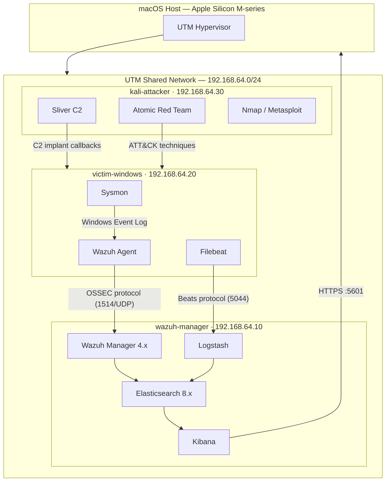

# Enterprise SOC Home Lab

[](LICENSE)
[](https://github.com/prajoti-rane/soc-home-lab/actions/workflows/ansible-lint.yml)
[](https://github.com/prajoti-rane/soc-home-lab/actions/workflows/yaml-lint.yml)
[](https://github.com/prajoti-rane/soc-home-lab/actions/workflows/markdown-lint.yml)


A fully automated, enterprise-grade Security Operations Center home lab running on macOS Apple Silicon (M-series) using UTM as the ARM64-native hypervisor. The lab deploys Wazuh SIEM, ELK Stack (Elasticsearch + Logstash + Kibana), Sysmon endpoint telemetry, Sliver C2 for red team simulation, and Atomic Red Team for MITRE ATT&CK coverage validation — all on ARM64 VMs provisioned via Ansible, with custom detection rules, incident reports, and full runbook documentation.

---

## What This Proves

This project demonstrates the hands-on skills that matter most in FAANG security engineering interviews:

| Skill | How it's demonstrated |
|-------|----------------------|
| **SIEM architecture** | Wazuh + ELK pipeline design, custom decoders, correlation rules |
| **Threat detection engineering** | Sigma rules, Wazuh custom rules, MITRE ATT&CK mapping |
| **Infrastructure as Code** | Ansible playbooks + roles for full lab provisioning |
| **Offensive security fundamentals** | Sliver C2, Atomic Red Team execution, kill chain simulation |
| **Incident response** | Structured incident reports with IOCs, timeline, and remediation |
| **Security architecture** | STRIDE threat model, network segmentation, data flow design |
| **CI/CD for security** | GitHub Actions: ansible-lint, yaml-lint, markdown-lint |
| **Documentation** | Runbook, architecture diagrams, decision log, resume bullets |

---

## Architecture



Full diagrams: [network-diagram.md](architecture/network-diagram.md) · [data-flow.md](architecture/data-flow.md)

---

## VM Specifications

| VM Name | OS | Arch | vCPU | RAM | Disk | IP | Role |
|---------|----|----|------|-----|------|----|------|
| wazuh-manager | Ubuntu 24.04 LTS | ARM64 | 4 | 8 GB | 60 GB | 192.168.64.10 | SIEM + ELK |
| victim-windows | Windows 11 ARM | ARM64 | 4 | 4 GB | 40 GB | 192.168.64.20 | Target endpoint |
| kali-attacker | Kali 2024.x | ARM64 | 4 | 4 GB | 40 GB | 192.168.64.30 | Red team |

**Host minimum:** Apple Silicon Mac, 16 GB RAM (24 GB recommended), 160 GB free disk.

Full specs: [vm-specs.md](architecture/vm-specs.md)

---

## Project Structure

```
soc-home-lab/
├── architecture/          # Network diagrams, data flow, STRIDE threat model, VM specs
├── runbook/               # Step-by-step human-executable setup guide
├── ansible/               # Playbooks + roles for automated provisioning
│   ├── playbooks/         # site.yml, wazuh-manager.yml, elk-stack.yml, kali.yml
│   └── roles/             # common, wazuh, elk, sysmon, filebeat, hardening
├── detections/
│   ├── wazuh-rules/       # Custom Wazuh XML detection rules
│   ├── sigma/             # Sigma rules (portable, tool-agnostic)
│   └── test-cases/        # Detection validation test cases
├── attack-simulation/
│   ├── sliver/            # Sliver C2 configs and operator notes
│   ├── atomic-red-team/   # ART test selection and execution guides
│   └── attack-scenarios/  # End-to-end attack scenario playbooks
├── incident-reports/      # Structured post-incident analysis reports
├── dashboards/kibana/     # Kibana dashboard exports
├── scripts/               # Utility and automation scripts
├── docs/                  # Resume bullets, interview prep, lab extension guide
├── DECISIONS.md           # Architecture decision log
└── STATUS.md              # Project phase tracker
```

---

## Quick Start

> Full setup takes 4–6 hours end-to-end. Follow the runbook in order.

1. **Check prerequisites** → [runbook/01-prerequisites.md](runbook/01-prerequisites.md)
2. **Create UTM VMs** → [runbook/02-utm-vm-creation.md](runbook/02-utm-vm-creation.md)
3. **Configure static IPs** → [runbook/03-network-setup.md](runbook/03-network-setup.md)
4. **Deploy Wazuh + ELK** → [runbook/04-wazuh-elk-install.md](runbook/04-wazuh-elk-install.md)
5. **Install Sysmon** → [runbook/05-sysmon-setup.md](runbook/05-sysmon-setup.md)
6. **Deploy Wazuh agents** → [runbook/06-agent-deployment.md](runbook/06-agent-deployment.md)
7. **Set up Kali tools** → [runbook/07-kali-setup.md](runbook/07-kali-setup.md)
8. **Run attack simulation** → [runbook/08-attack-simulation.md](runbook/08-attack-simulation.md)
9. **Validate detections** → [runbook/09-detection-validation.md](runbook/09-detection-validation.md)

For anything requiring GUI interaction: [runbook/MANUAL_STEPS.md](runbook/MANUAL_STEPS.md)

---

## Detection Coverage

### MITRE ATT&CK Techniques Covered

| Technique | ID | Tactic | Detection Method |
|-----------|-----|--------|----------------|
| PowerShell Execution | T1059.001 | Execution | Sysmon EventID 1 + Wazuh rule |
| Scheduled Task Creation | T1053.005 | Persistence | Wazuh rule 18104 + EventID 4698 |
| Registry Run Key | T1547.001 | Persistence | Sysmon EventID 13 + custom rule |
| Process Injection | T1055 | Defense Evasion | Sysmon EventID 10 + rule 92000 |
| Credential Dumping (LSASS) | T1003.001 | Credential Access | Sysmon EventID 10 (lsass.exe access) |
| Network Scanning | T1046 | Discovery | Wazuh rule 40101 + Suricata |
| Lateral Movement via SMB | T1021.002 | Lateral Movement | EventID 4624 type 3 + Impacket IOC |
| C2 over HTTPS | T1071.001 | C&C | DNS anomaly detection + JA3 hash |
| Data Staged in Temp | T1074.001 | Collection | Sysmon EventID 11 (temp file creation) |
| Event Log Clearing | T1070.001 | Defense Evasion | Wazuh rule 18145 (EventID 1102) |

---

## Resume Impact

Copy-paste ready bullets for your resume or LinkedIn:

- **Engineered enterprise SOC home lab** on macOS Apple Silicon (UTM/QEMU ARM64) with Wazuh SIEM, ELK Stack, and custom detection rules covering 10+ MITRE ATT&CK techniques across the full kill chain
- **Automated 3-VM lab provisioning** with Ansible (playbooks + 6 roles), reducing setup time from ~6 hours manual to ~45 minutes, with idempotent, version-controlled infrastructure
- **Developed custom Wazuh detection rules and Sigma signatures** validated against Atomic Red Team technique simulations (T1059, T1055, T1003, T1070) with documented true-positive rates
- **Executed full kill chain simulation** using Sliver C2 framework (implant delivery → persistence → credential access → lateral movement) with end-to-end incident report documenting IOCs, timeline, and remediation
- **Designed STRIDE threat model** for lab environment identifying 6 critical/high risks with corresponding detection rules and mitigations in Wazuh

---

## Links

| Resource | Link |
|----------|------|
| Architecture | [architecture/](architecture/) |
| Runbook | [runbook/](runbook/) |
| Detection Rules | [detections/](detections/) |
| Attack Scenarios | [attack-simulation/attack-scenarios/](attack-simulation/attack-scenarios/) |
| Incident Reports | [incident-reports/](incident-reports/) |
| Decision Log | [DECISIONS.md](DECISIONS.md) |
| Project Status | [STATUS.md](STATUS.md) |
| Interview Prep | [docs/interview-prep.md](docs/interview-prep.md) |

---

## Project Status

See [STATUS.md](STATUS.md) for current phase progress.

---

Built by **Prajoti Rane** — WPI MS Cybersecurity  
[prane@wpi.edu](mailto:prane@wpi.edu) · [github.com/prajoti-rane](https://github.com/prajoti-rane)
