# Data Flow — Log Pipeline

## End-to-End Log Pipeline

```mermaid
flowchart LR
    subgraph WIN["victim-windows (192.168.64.20)"]
        direction TB
        P["Process / File / Network\nActivity"]
        SY["Sysmon\n~500–2,000 events/min"]
        WEL["Windows Event Log\n(Security + Sysmon channel)"]
        WA["Wazuh Agent\n~200–800 events/min\n(filtered)"]
        FB["Filebeat\n~50–100 EPS"]
    end

    subgraph MGR["wazuh-manager (192.168.64.10)"]
        direction TB
        WM["Wazuh Manager\nCorrelation Engine\n~50–800 EPS in"]
        DEC["Decoder Engine\n(XML decoders)"]
        RULES["Rule Engine\n(3,000+ default rules)"]
        ALERTS["Alert Generator\n~5–50 alerts/min\n(attack scenario)"]
        LS["Logstash\nGrok + Mutate + Enrich"]
        ES["Elasticsearch\nIndex: wazuh-alerts-*\nwazuh-archives-*"]
        KB["Kibana\nSecurity dashboards\nDrilldown + SIEM"]
    end

    P --> SY
    SY -->|"EventID 1,3,7,10,11\nkernel-level telemetry"| WEL
    WEL -->|"Event subscription\n(log read)"| WA
    WA -->|"OSSEC protocol\nUDP 1514\nTLS-encrypted"| WM
    WEL -->|"Harvested log lines"| FB
    FB -->|"Beats protocol\nTCP 5044"| LS

    WM --> DEC
    DEC --> RULES
    RULES --> ALERTS
    ALERTS -->|"Alert JSON\nwazuh-alerts-* index"| ES
    LS -->|"Enriched events\nwazuh-archives-* index"| ES
    ES -->|"Index API queries"| KB
```

## Pipeline Stages Detail

### Stage 1 — Sysmon Telemetry Generation
- **Source:** Sysmon driver installed on Windows 11 ARM64
- **Config:** SwiftOnSecurity ruleset (filtered for noise reduction)
- **Key Event IDs:** 1 (process create), 3 (network connect), 7 (image load), 10 (process access), 11 (file create), 13 (registry set), 22 (DNS query)
- **Volume:** ~500–2,000 raw events/min during active use; ~5,000–20,000 during attack simulation

### Stage 2 — Windows Event Log Buffering
- Sysmon writes to `Microsoft-Windows-Sysmon/Operational` channel
- Windows Security log captures logon events (EventID 4624, 4625, 4648, 4688)
- Local buffer protects against network interruptions

### Stage 3 — Wazuh Agent Collection & Forwarding
- Agent reads both Sysmon and Security event channels
- Applies local pre-filtering rules to reduce noise
- Forwards over TLS to Wazuh Manager port 1514/UDP
- **Volume reduction:** ~60–80% filtered before send

### Stage 4 — Wazuh Manager Decode & Correlate
- XML decoders parse raw event fields (process name, parent, hash, IP)
- Rule engine applies ~3,000 built-in + custom rules
- Generates structured alerts with `rule.id`, `rule.level`, `agent.name`
- Alerts with level ≥ 3 written to `wazuh-alerts-*` Elasticsearch index

### Stage 5 — Filebeat → Logstash (Parallel Path)
- Filebeat tails Wazuh archives for complete event stream (not just alerts)
- Logstash pipeline: Grok parse → IP geolocation → MITRE ATT&CK tag enrichment → normalize timestamps

### Stage 6 — Elasticsearch Indexing
- **Indices:**
  - `wazuh-alerts-4.x-YYYY.MM.DD` — correlated alerts only
  - `wazuh-archives-4.x-YYYY.MM.DD` — all raw events
- ILM policy: hot (7 days) → warm (30 days) → delete
- Expected storage: ~1–5 GB/day during attack simulation

### Stage 7 — Kibana Visualization
- Pre-built Wazuh dashboards: MITRE ATT&CK heatmap, agent overview, alert timeline
- Custom dashboards: Sliver C2 detection, lateral movement, persistence techniques
- Drill-down: alert → raw event → process tree → file hash → VirusTotal

## Alert Volume Estimates

| Scenario | Raw Events/min | Alerts Generated | Notes |
|----------|---------------|-----------------|-------|
| Idle Windows VM | 50–100 | 0–2 | Background noise |
| Normal user activity | 200–500 | 2–10 | File ops, browser |
| Atomic Red Team run | 2,000–10,000 | 50–200 | Per technique |
| Sliver C2 active session | 5,000–20,000 | 100–500 | Full kill chain |
