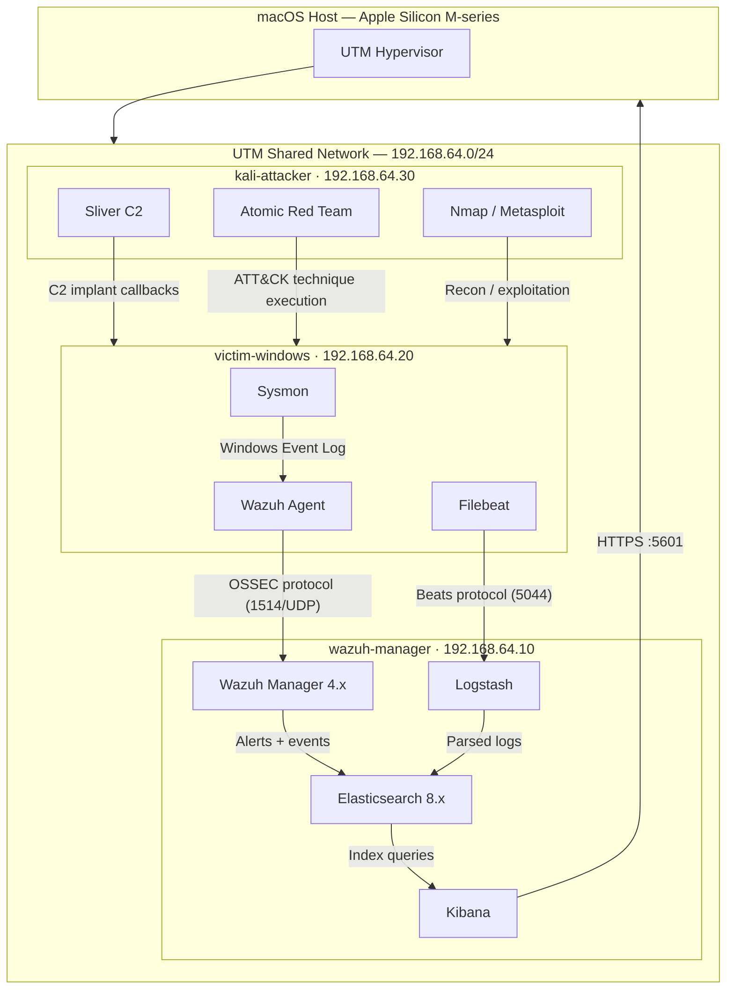

# Network Diagram

## Lab Topology

## Subnet Allocation

| Subnet | Purpose |
|--------|---------|
| 192.168.64.0/24 | UTM shared network — all VMs |
| 192.168.64.1 | UTM gateway (host NAT) |
| 192.168.64.10 | wazuh-manager (static) |
| 192.168.64.20 | victim-windows (static) |
| 192.168.64.30 | kali-attacker (static) |
| 192.168.64.100–200 | DHCP pool (reserved, unused) |

## Network Mode Decision

UTM **Shared Network** mode is used (not Bridged). This:

- Isolates lab traffic from the home LAN
- Provides consistent, router-independent IPs via UTM's built-in DHCP
- Allows host → VM access (Kibana, SSH) without exposing VMs to the LAN
- See [DECISIONS.md](../DECISIONS.md) entry #2 for full rationale

## Port Reference

| Port | Protocol | Direction | Service |
|------|----------|-----------|---------|
| 1514 | UDP | Agent → Manager | Wazuh event forwarding |
| 1515 | TCP | Agent → Manager | Wazuh agent registration |
| 55000 | TCP | Host → Manager | Wazuh API |
| 5044 | TCP | Filebeat → Logstash | Beats input |
| 9200 | TCP | Internal | Elasticsearch REST API |
| 5601 | TCP | Host → Manager | Kibana dashboard |
| 22 | TCP | Host → All VMs | SSH management |
